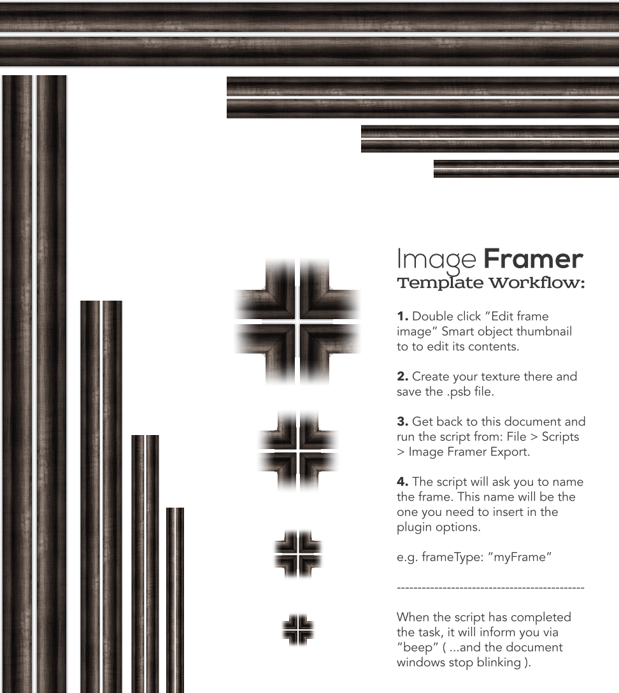

## Image Framer Export Script

The script along with the .psd template will make it easy to make frames for: [Image Framer jQuery Plugin](https://github.com/joonaspaakko/Image-Framer-jquery-plugin)

You only need to make top and bottom texture for the frame and the template & sript will help you to export all 4 frame sizes to separate folders in a **snap!**

It takes approximately 4 minutes plus `{ the time it takes for you to create the texture }`, to create a frame with the teamplate and the script.

**It should be noted that the .psd template also works with [slicy](http://macrabbit.com/slicy/).**

## How to use the script

* Put `Image Framer Export.jsx` into: `{Photoshop_root}\Presets\Scripts\Image Framer Export.jsx`
  * If photoshop is already running, restart it.
* Open `Image Framer Export Template.psd` in photoshop.
* Double click `Edit frame image` smart object to edit the contents.
* Create your frame texture and save the .psb file.
* Get back to `Image Framer Export Template.psd` and run the script `File > Scripts > Image Framer Export.jsx`.
* You will be asked to insert your desired frame name ( You can use the frame with the plugin like this: frameType: "yourFrame" ).
* The script will `beep` when the exporting is complete.
* You'll find the files/folders next to the `Image Framer Export Template.psd`. You will need to put them in `{your_website_root}/imageframer/frames/`

**The script was tested in Photoshop cs 3 and cs 6 in Mac.**
